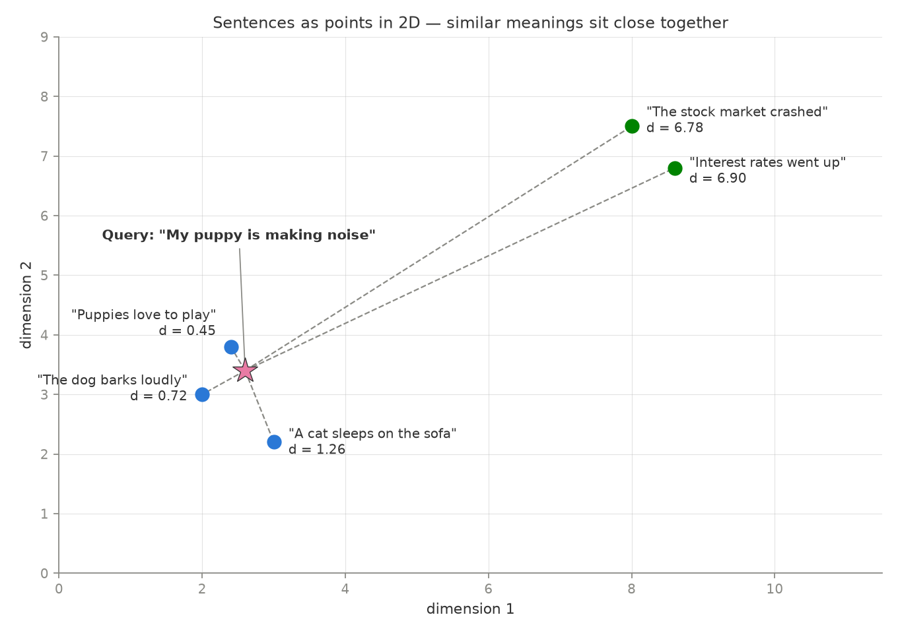
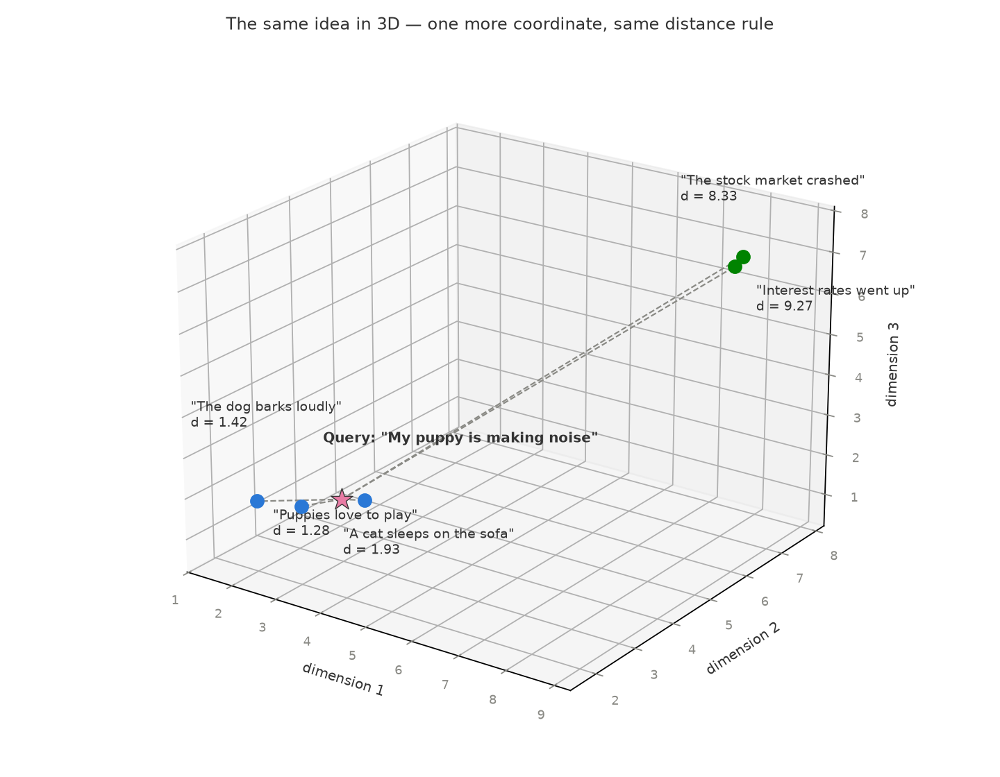

# RAG - Retrieval-Augmented Generation

## Part 1 - Embeddings

### What is this?

An embedding is a way of representing something — a word, a sentence, an image, a product — as a list of numbers (a vector) in a way that captures its meaning. Instead of treating a word like "dog" as just a string of characters, an embedding turns it into something like `[0.12, -0.98, 0.44, ...]`, often with hundreds of dimensions.

The key idea is that similar things end up close together in this numeric space. So the vectors for "dog" and "cat" would be near each other, while "dog" and "airplane" would be far apart. 

### Sentence Transformers

**Sentence Transformers** (also known by the library name SBERT, from "Sentence-BERT") solve this. They're neural network models — built on transformer architectures like BERT — that are specifically fine-tuned to produce one meaningful embedding for an entire sentence or short document. Two sentences that mean the same thing, like "How old are you?" and "What is your age?", will get vectors that are very close together, even though they share few words.

### Demo 1

* Run Jupyter

## Part 2 - Explanation

### Embeddings are points in space

Imagine an embedding model that outputs only **2 numbers** per sentence. Each sentence becomes a point `(x, y)` on the Cartesian plane, and because the model captures meaning, **similar sentences land close together** — animal sentences form one cluster, finance sentences another.

To search, the query is embedded too, becoming just another point. Then we rank sentences by **Euclidean distance** — the straight-line distance you'd measure with a ruler:

$$d(p, q) = \sqrt{(q_1 - p_1)^2 + (q_2 - p_2)^2}$$

For the query **"My puppy is making noise"** at `(2.6, 3.4)` vs "The dog barks loudly" at `(2.0, 3.0)`:

$$d = \sqrt{(2.6 - 2.0)^2 + (3.4 - 3.0)^2} = \sqrt{0.52} \approx 0.72$$



The smallest distance wins: "Puppies love to play" (d = 0.45) is the best match even though it shares **no words** with the query — proximity encodes meaning, not vocabulary.

### Adding a dimension: 3D

With 3 numbers per sentence, each point becomes `(x, y, z)` and the formula just gains one more term:

$$d(p, q) = \sqrt{(q_1 - p_1)^2 + (q_2 - p_2)^2 + (q_3 - p_3)^2}$$



The clusters are still there, and the closest point to the query is still the puppy sentence.

### From 3 dimensions to 384

Real sentence transformers output vectors with hundreds of dimensions (e.g. 384 or 768). We can't draw that, but retrieval is the **same formula** generalized to $n$ dimensions: embed every document once, embed the query, return the $k$ closest points.

$$d(p, q) = \sqrt{\sum_{i=1}^{n} (q_i - p_i)^2}$$

### Cosine similarity

In practice, most vector databases rank with **cosine similarity** instead: the angle between the two vectors, not the distance between the points.

$$\cos(\theta) = \frac{p \cdot q}{\|p\| \, \|q\|} = \frac{\sum_{i=1}^{n} p_i \, q_i}{\sqrt{\sum_{i=1}^{n} p_i^2} \, \sqrt{\sum_{i=1}^{n} q_i^2}}$$

The result falls between $-1$ (opposite meaning) and $1$ (identical meaning). For our query `(2.6, 3.4)` vs "The dog barks loudly" `(2.0, 3.0)`:

$$\cos(\theta) = \frac{(2.6)(2.0) + (3.4)(3.0)}{\sqrt{2.6^2 + 3.4^2} \, \sqrt{2.0^2 + 3.0^2}} = \frac{15.4}{4.28 \times 3.61} \approx 0.997$$

Almost the same direction — a very strong match. Note the flip: for **similarity** higher is better, for **distance** lower is better.

## Part 3 - Persisting in a database (pgvector)

In Demo 1, Python computed the scores and sorted the results. In a real system that work moves to the database: **PostgreSQL with the [pgvector](https://github.com/pgvector/pgvector) extension** stores the embeddings in a `VECTOR(384)` column and ranks the rows itself — the query below returns the top matches already sorted, no Python math involved:

```sql
SELECT content,
       1 - (embedding <=> '[...query vector...]'::vector) AS cosine_similarity
FROM documents
ORDER BY embedding <=> '[...query vector...]'::vector
LIMIT 3;
```

pgvector ships the distance functions from Part 2 as SQL operators:

| Operator | Meaning |
|---|---|
| `<=>` | Cosine distance ($1 - \cos\theta$) |
| `<->` | Euclidean distance |

### Demo 2

```bash
cd demo2-persist-on-database
docker compose up -d   # starts PostgreSQL + pgvector on port 5433
```

Then open `main.ipynb`: it embeds the sentences with the same Sentence Transformer, inserts them with plain SQL, and lets PostgreSQL do the scoring and the `ORDER BY`.
